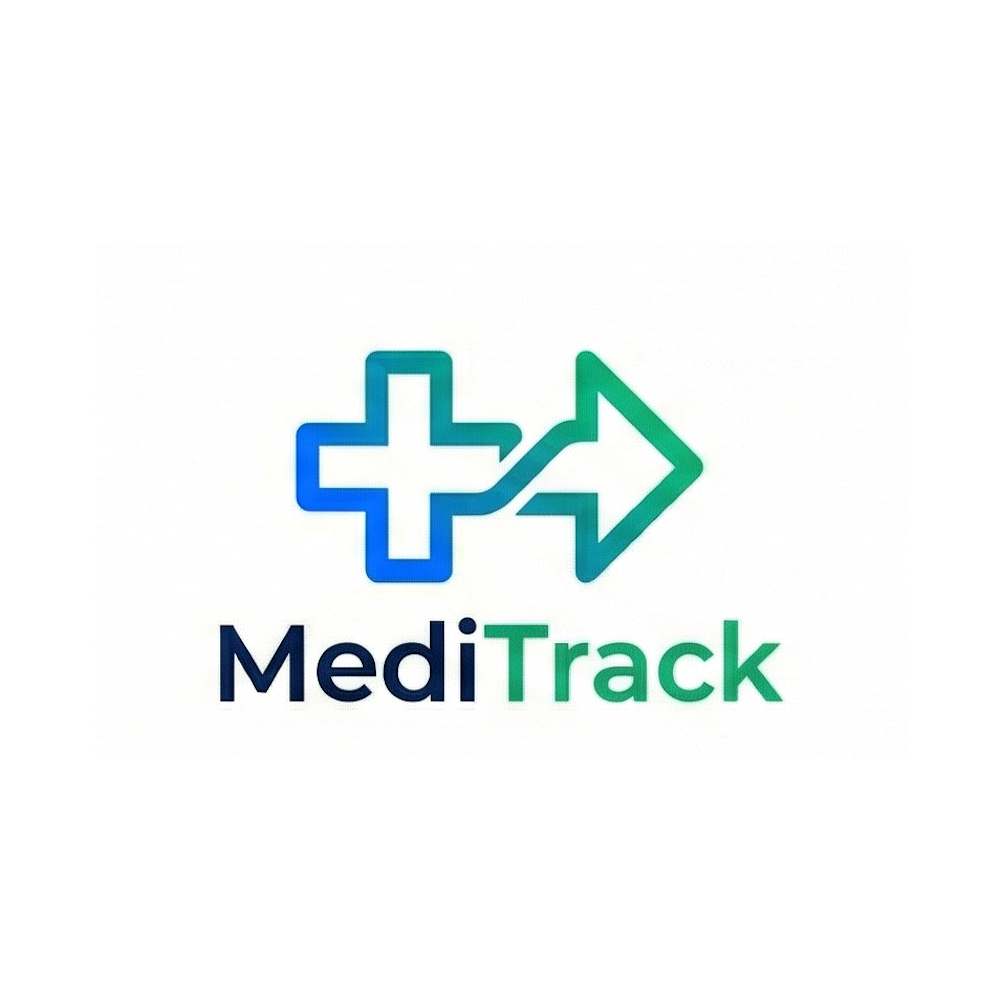
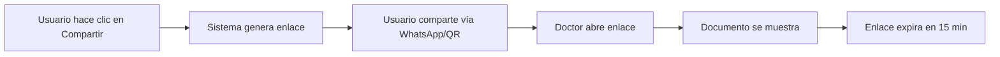

<h1 align="center">MediTrack: Platanus Hack Project</h1>

  

  <strong>Track:</strong> ☎️ legacy | <strong>Team:</strong> team-14

  <a href="https://github.com/magdalenarojas">Magdalena Rojas</a> • 
  <a href="https://github.com/telgueta">Tomás Elgueta</a> • 
  <a href="https://github.com/anabel29">Anabel Paz</a> • 
  <a href="https://github.com/ndejourdan">Nicole De Jourdan</a>

---

  <em>Aplicación Next.js para gestionar y registrar documentos médicos con una interfaz amigable y poder compartir de forma segura y sencilla con otros profesionales de la salud su información clínica.</em>

---

## 📋 Tabla de Contenido

- [🎯 Problema](#-problema)
- [💡 Solución](#-solución)
- [✨ Características Principales](#-características-principales)
  - [Gestión de Documentos](#1-gestión-de-documentos)
  - [Compartir Seguro](#2-compartir-seguro)
  - [Experiencia de Usuario](#3-experiencia-de-usuario)
- [🛣️ Rutas Principales](#️-rutas-principales)
- [🔄 Flujo de Compartir](#-flujo-de-compartir)
- [🛠️ Stack Tecnológico](#️-stack-tecnológico)

---

## 🎯 Problema

Las personas tienen dificultades para organizar documentos médicos, recordar su historial clínico, buscar recetas e incluso exámenes. A menudo pierden información y necesitan imprimir documentos al visitar diferentes centros médicos o proveedores de salud.

> **Impacto especial:** Este problema afecta principalmente a adultos de tercera edad.

---

## 💡 Solución

- ✅ **Gestión centralizada** de documentos médicos vía WebApp + Agente Chatbot
- 🔒 **Compartir seguro** con URLs firmadas de tiempo limitado (expiración de 15 min)
- 📱 **Sin impresión física** ni organización manual
- 🔓 **Sin autenticación requerida** para proveedores de salud que ven documentos compartidos
- 👴 **Diseño accesible** con interfaz simple y de fácil uso para adultos de tercera edad

---

## ✨ Características Principales

### 1. Gestión de Documentos
- 📄 Subir documentos médicos (PDF, JPG, PNG)
- 🏷️ Categorización y seguimiento de estado
- 📅 Vistas de línea de tiempo y lista

### 2. Compartir Seguro
- 🔗 Generar enlaces para compartir: `https://app.com/share/{id}`
- ⏱️ Expiración de 15 minutos vía URLs presignadas de S3
- 📱 Soporte de código QR para compartir en persona
- 🚫 No se requiere autenticación para destinatarios
- 🎯 UI mínima (solo documento, sin navegación)

### 3. Experiencia de Usuario
- 🇪🇸 Interfaz en español
- 🔤 Fuentes grandes (18-24px) para legibilidad
- 🧭 Navegación simple para usuarios no técnicos

---

## 🔄 Flujo de Compartir

**Pasos:**
1. 👤 Usuario hace clic en "Compartir" en el documento
2. 🔗 Sistema genera enlace: `/share/{examId}`
3. 📲 Usuario comparte vía WhatsApp/código QR
4. 👨‍⚕️ Doctor abre el enlace (sin inicio de sesión)
5. 📄 Documento se muestra con botón de descarga
6. ⏰ Enlace expira después de 15 minutos

---

## 🛠️ Stack Tecnológico

### Frontend
- **Framework:** Next.js 14 (App Router)
- **Language:** TypeScript
- **UI:** Ant Design + shadcn/ui + Tailwind CSS
- **GraphQL Client:** Apollo Client

### Backend
- **Database:** PostgreSQL + Prisma ORM
- **Storage:** AWS S3 (presigned URLs)
- **API:** GraphQL

---

  Made with ❤️ by team-14 for Platanus Hack

